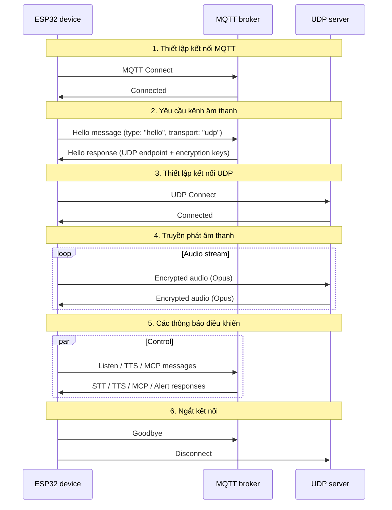
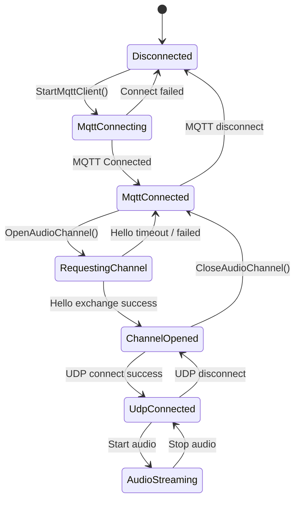

# Giao thức Truyền thông Lai MQTT + UDP

Tài liệu này mô tả giao thức lai MQTT + UDP được sử dụng giữa thiết bị và máy chủ, dựa trên triển khai hiện tại: MQTT mang các thông báo điều khiển, UDP mang âm thanh thời gian thực.

---

## 1. Tổng quan

Giao thức sử dụng hai kênh:

- **MQTT** - các thông báo điều khiển, đồng bộ hóa trạng thái, tải trọng JSON.
- **UDP** - âm thanh thời gian thực, được mã hóa.

### 1.1 Đặc điểm chính

- **Thiết kế kênh kép** - điều khiển được tách biệt khỏi dữ liệu để âm thanh có độ trễ thấp.
- **Vận chuyển được mã hóa** - âm thanh UDP được mã hóa bằng AES-CTR.
- **Số thứ tự** - chống lại việc phát lại và sắp xếp lại.
- **Kết nối lại tự động** - MQTT kết nối lại khi bị ngắt kết nối.

---

## 2. Luồng từ đầu đến cuối



---

## 3. Kênh Điều khiển MQTT

### 3.1 Kết nối

Thiết bị kết nối với broker bằng cách sử dụng:
- **Endpoint** - host và cổng của broker.
- **Client ID** - định danh thiết bị.
- **Username / Password** - thông tin xác thực.
- **Keep Alive** - khoảng thời gian nhịp tim (mặc định 240 s).

### 3.2 Trao đổi Hello

#### 3.2.1 Thiết bị -> Máy chủ

```json
{
  "type": "hello",
  "version": 3,
  "transport": "udp",
  "features": {
    "mcp": true,
    "aec": true
  },
  "audio_params": {
    "format": "opus",
    "sample_rate": 16000,
    "channels": 1,
    "frame_duration": 60
  }
}
```

`features.mcp` luôn được đặt; `features.aec` được đặt khi `CONFIG_USE_SERVER_AEC` được bật.

#### 3.2.2 Máy chủ -> Thiết bị

```json
{
  "type": "hello",
  "transport": "udp",
  "session_id": "xxx",
  "audio_params": {
    "format": "opus",
    "sample_rate": 24000,
    "channels": 1,
    "frame_duration": 60
  },
  "udp": {
    "server": "192.168.1.100",
    "port": 8888,
    "key": "0123456789ABCDEF0123456789ABCDEF",
    "nonce": "0123456789ABCDEF0123456789ABCDEF"
  }
}
```

Tham chiếu trường:
- `udp.server` - địa chỉ máy chủ UDP.
- `udp.port` - cổng máy chủ UDP.
- `udp.key` - khóa AES, được mã hóa hex.
- `udp.nonce` - nonce AES, được mã hóa hex.

### 3.3 Các loại thông báo JSON

#### 3.3.1 Thiết bị -> Máy chủ

1. **Listen**
   ```json
   {
     "session_id": "xxx",
     "type": "listen",
     "state": "start",
     "mode": "manual"
   }
   ```

2. **Abort**
   ```json
   {
     "session_id": "xxx",
     "type": "abort",
     "reason": "wake_word_detected"
   }
   ```

3. **MCP**
   ```json
   {
     "session_id": "xxx",
     "type": "mcp",
     "payload": {
       "jsonrpc": "2.0",
       "id": 1,
       "result": {}
     }
   }
   ```

4. **Goodbye**
   ```json
   {
     "session_id": "xxx",
     "type": "goodbye"
   }
   ```

#### 3.3.2 Máy chủ -> Thiết bị

Ngữ nghĩa khớp với giao thức WebSocket. Các loại được hỗ trợ:
- **STT** - kết quả nhận dạng giọng nói.
- **TTS** - vòng đời TTS (`start`, `stop`, `sentence_start`).
- **LLM** - cập nhật cảm xúc cho giao diện người dùng.
- **MCP** - điều khiển IoT.
- **System** - điều khiển hệ thống, ví dụ: `"command": "reboot"`.
- **Alert** - hiển thị cảnh báo trên giao diện người dùng; các trường: `status`, `message`, `emotion`.
- **Goodbye** - tắt phiên âm thanh do máy chủ khởi tạo. Thiết bị phản hồi bằng cách đóng kênh UDP mà không gửi goodbye của riêng nó.
- **Custom** (tùy chọn, được bật thông qua `CONFIG_RECEIVE_CUSTOM_MESSAGE`).

Ví dụ cảnh báo:
```json
{
  "session_id": "xxx",
  "type": "alert",
  "status": "Warning",
  "message": "Battery low",
  "emotion": "sad"
}
```

---

## 4. Kênh Âm thanh UDP

### 4.1 Thiết lập kênh

Sau khi thiết bị nhận phản hồi hello MQTT, nó:
1. Phân tích host và cổng UDP.
2. Phân tích khóa AES và nonce.
3. Khởi tạo ngữ cảnh AES-CTR.
4. Mở socket UDP.

### 4.2 Định dạng gói âm thanh

#### 4.2.1 Gói âm thanh được mã hóa

```
|type 1B|flags 1B|payload_len 2B|ssrc 4B|timestamp 4B|sequence 4B|
|payload payload_len bytes|
```

Tham chiếu trường:
- `type`: loại gói, luôn là `0x01`.
- `flags`: cờ, hiện chưa được sử dụng.
- `payload_len`: độ dài tải trọng (thứ tự byte mạng).
- `ssrc`: định danh nguồn đồng bộ hóa.
- `timestamp`: dấu thời gian (thứ tự byte mạng).
- `sequence`: số thứ tự (thứ tự byte mạng).
- `payload`: dữ liệu âm thanh Opus được mã hóa.

#### 4.2.2 Mã hóa

Sử dụng **AES-CTR** với:
- **Key**: 128-bit, do máy chủ cung cấp.
- **Nonce**: 128-bit, do máy chủ cung cấp.
- **Counter**: được xây dựng từ dấu thời gian và số thứ tự.

### 4.3 Quản lý số thứ tự

- **Người gửi**: `local_sequence_` được tăng đơn điệu.
- **Người nhận**: `remote_sequence_` xác thực tính liên tục.
- **Chống phát lại**: các gói có số thứ tự thấp hơn giá trị mong đợi sẽ bị loại bỏ.
- **Dung sai**: các khoảng trống nhỏ được ghi lại dưới dạng cảnh báo nhưng vẫn được chấp nhận.

### 4.4 Xử lý lỗi

1. **Lỗi giải mã** - ghi lại lỗi và loại bỏ gói.
2. **Khoảng trống thứ tự** - ghi lại cảnh báo, tiếp tục xử lý gói.
3. **Gói bị lỗi định dạng** - ghi lại lỗi và loại bỏ.

---

## 5. Quản lý Trạng thái

### 5.1 Trạng thái kết nối



### 5.2 Kiểm tra trạng thái

Thiết bị xác định liệu kênh âm thanh có khả dụng hay không bằng:
```cpp
bool IsAudioChannelOpened() const {
    return udp_ != nullptr && !error_occurred_ && !IsTimeout();
}
```

---

## 6. Tham số Cấu hình

### 6.1 Cài đặt MQTT

Đọc từ bộ nhớ:
- `endpoint` - địa chỉ broker.
- `client_id` - định danh client.
- `username` - tên người dùng.
- `password` - mật khẩu.
- `keepalive` - khoảng thời gian giữ kết nối (mặc định 240 s).
- `publish_topic` - chủ đề xuất bản.

### 6.2 Tham số Âm thanh

- **Format**: Opus
- **Tốc độ mẫu**: 16 kHz thiết bị / 24 kHz máy chủ
- **Kênh**: 1 (mono)
- **Thời lượng khung**: 60 ms

---

## 7. Xử lý Lỗi và Kết nối lại

### 7.1 Kết nối lại MQTT

- Tự động thử lại khi kết nối thất bại.
- Báo cáo lỗi tùy chọn.
- Dọn dẹp chạy khi ngắt kết nối.

### 7.2 Kết nối UDP

- Không có thử lại tự động; phụ thuộc vào việc đàm phán lại qua MQTT.
- Trạng thái có thể được truy vấn bất cứ lúc nào.

### 7.3 Hết thời gian chờ

Lớp `Protocol` cơ bản cung cấp phát hiện hết thời gian chờ:
- Thời gian chờ mặc định: 120 s.
- Dựa trên thời gian kể từ gói tin đến cuối cùng.
- Sau khi hết thời gian chờ, kênh được đánh dấu là không khả dụng.

---

## 8. Bảo mật

### 8.1 Mã hóa vận chuyển

- **MQTT**: hỗ trợ TLS/SSL (cổng 8883).
- **UDP**: AES-CTR trên các tải trọng âm thanh.

### 8.2 Xác thực

- **MQTT**: tên người dùng / mật khẩu.
- **UDP**: các khóa được phân phối qua kênh MQTT.

### 8.3 Chống phát lại

- Số thứ tự tăng đơn điệu.
- Các gói cũ bị loại bỏ.
- Dấu thời gian được xác thực.

---

## 9. Ghi chú về Hiệu suất

### 9.1 Đồng thời

Một mutex bảo vệ kết nối UDP:
```cpp
std::lock_guard<std::mutex> lock(channel_mutex_);
```

### 9.2 Quản lý bộ nhớ

- Các đối tượng mạng được tạo và hủy động.
- Các gói âm thanh được quản lý bằng con trỏ thông minh.
- Các ngữ cảnh mã hóa được giải phóng kịp thời.

### 9.3 Tối ưu hóa mạng

- Tái sử dụng kết nối UDP.
- Kích thước gói hợp lý.
- Kiểm tra tính liên tục của số thứ tự.

---

## 10. So sánh với WebSocket

| Tính năng | MQTT + UDP | WebSocket |
|---------|------------|-----------|
| Kênh điều khiển | MQTT | WebSocket |
| Kênh âm thanh | UDP (mã hóa) | WebSocket (nhị phân) |
| Độ trễ | Thấp (UDP) | Trung bình |
| Độ tin cậy | Trung bình | Cao |
| Độ phức tạp | Cao | Thấp |
| Mã hóa | AES-CTR | TLS |
| Thân thiện với Firewall | Thấp | Cao |

---

## 11. Ghi chú Triển khai

### 11.1 Mạng

- Đảm bảo các cổng UDP có thể truy cập được.
- Cấu hình các quy tắc tường lửa cho phù hợp.
- Lên kế hoạch cho việc vượt qua NAT nếu cần.

### 11.2 Cơ sở hạ tầng Máy chủ

- Cấu hình broker MQTT.
- Triển khai máy chủ UDP.
- Quản lý khóa.

### 11.3 Giám sát

- Tỷ lệ thành công kết nối.
- Độ trễ truyền âm thanh.
- Mất gói.
- Lỗi giải mã.

---

## 12. Tóm tắt

Giao thức lai MQTT + UDP đạt được giao tiếp âm thanh hiệu quả thông qua:

- **Kiến trúc tách biệt** - các kênh điều khiển và dữ liệu riêng biệt với trách nhiệm rõ ràng.
- **Mã hóa** - AES-CTR bảo vệ các tải trọng âm thanh.
- **Quản lý số thứ tự** - ngăn chặn phát lại và sắp xếp lại.
- **Khôi phục tự động** - MQTT kết nối lại khi thất bại.
- **Hiệu suất** - UDP giữ độ trễ âm thanh thấp.

Giao thức này phù hợp cho tương tác giọng nói độ trễ thấp, với chi phí là độ phức tạp mạng cao hơn so với WebSocket thuần túy.

```
