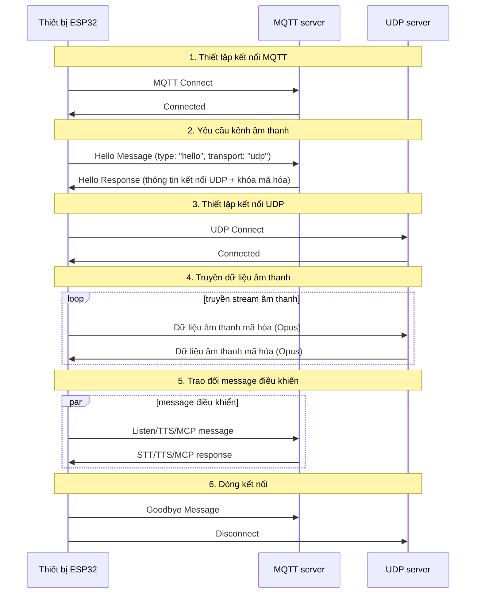
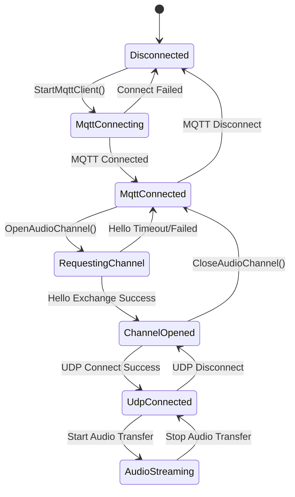

# Tài liệu giao thức MQTT + UDP hỗn hợp

Đây là tài liệu giao thức MQTT + UDP được tổng hợp từ cách triển khai trong code, mô tả cách thiết bị và server giao tiếp bằng MQTT cho các message điều khiển, và dùng UDP cho dữ liệu âm thanh.

---

## 1. Tổng quan giao thức

Giao thức này dùng mô hình truyền hỗn hợp:
- **MQTT**: dùng cho message điều khiển, đồng bộ trạng thái, trao đổi JSON
- **UDP**: dùng cho truyền âm thanh thời gian thực, có hỗ trợ mã hóa

### 1.1 Đặc điểm

- **Thiết kế hai kênh**: tách điều khiển và dữ liệu để đảm bảo tính thời gian thực
- **Truyền có mã hóa**: dữ liệu âm thanh qua UDP dùng AES-CTR
- **Bảo vệ bằng số thứ tự**: chống phát lại gói tin và chống xáo trộn thứ tự
- **Tự động kết nối lại**: khi MQTT bị ngắt sẽ tự reconnect

---

## 2. Tổng quan luồng hoạt động



---

## 3. Kênh điều khiển MQTT

### 3.1 Thiết lập kết nối

Thiết bị kết nối tới server bằng MQTT, các tham số kết nối gồm:
- **Endpoint**: địa chỉ và cổng của MQTT server
- **Client ID**: định danh duy nhất của thiết bị
- **Username/Password**: thông tin xác thực
- **Keep Alive**: chu kỳ heartbeat (mặc định 240 giây)

### 3.2 Trao đổi Hello

#### 3.2.1 Thiết bị gửi Hello

```json
{
  "type": "hello",
  "version": 3,
  "transport": "udp",
  "features": {
    "mcp": true
  },
  "audio_params": {
    "format": "opus",
    "sample_rate": 16000,
    "channels": 1,
    "frame_duration": 60
  }
}
```

#### 3.2.2 Server phản hồi Hello

```json
{
  "type": "hello",
  "transport": "udp",
  "session_id": "xxx",
  "audio_params": {
    "format": "opus",
    "sample_rate": 24000,
    "channels": 1,
    "frame_duration": 60
  },
  "udp": {
    "server": "192.168.1.100",
    "port": 8888,
    "key": "0123456789ABCDEF0123456789ABCDEF",
    "nonce": "0123456789ABCDEF0123456789ABCDEF"
  }
}
```

**Giải thích trường:**
- `udp.server`: địa chỉ UDP server
- `udp.port`: cổng UDP server
- `udp.key`: khóa mã hóa AES (chuỗi hex)
- `udp.nonce`: số ngẫu nhiên AES (chuỗi hex)

### 3.3 Các loại message JSON

#### 3.3.1 Thiết bị → server

1. **Listen**
   ```json
   {
     "session_id": "xxx",
     "type": "listen",
     "state": "start",
     "mode": "manual"
   }
   ```

2. **Abort**
   ```json
   {
     "session_id": "xxx",
     "type": "abort",
     "reason": "wake_word_detected"
   }
   ```

3. **MCP**
   ```json
   {
     "session_id": "xxx",
     "type": "mcp",
     "payload": {
       "jsonrpc": "2.0",
       "id": 1,
       "result": {...}
     }
   }
   ```

4. **Goodbye**
   ```json
   {
     "session_id": "xxx",
     "type": "goodbye"
   }
   ```

#### 3.3.2 Server → thiết bị

Các loại message hỗ trợ giống giao thức WebSocket, gồm:
- **STT**: kết quả nhận dạng giọng nói
- **TTS**: điều khiển tổng hợp giọng nói
- **LLM**: điều khiển biểu cảm
- **MCP**: điều khiển IoT
- **System**: điều khiển hệ thống
- **Custom**: message tùy biến (tùy chọn)

---

## 4. Kênh âm thanh UDP

### 4.1 Thiết lập kết nối

Sau khi nhận phản hồi Hello từ MQTT, thiết bị dùng thông tin UDP trong đó để tạo kênh âm thanh:
1. Phân tích địa chỉ và cổng UDP server
2. Phân tích khóa mã hóa và số ngẫu nhiên
3. Khởi tạo ngữ cảnh mã hóa AES-CTR
4. Thiết lập kết nối UDP

### 4.2 Định dạng dữ liệu âm thanh

#### 4.2.1 Cấu trúc gói âm thanh đã mã hóa

```
|type 1byte|flags 1byte|payload_len 2bytes|ssrc 4bytes|timestamp 4bytes|sequence 4bytes|
|payload payload_len bytes|
```

**Giải thích trường:**
- `type`: loại gói, cố định là `0x01`
- `flags`: cờ, hiện chưa dùng
- `payload_len`: độ dài payload (thứ tự byte mạng)
- `ssrc`: định danh nguồn đồng bộ
- `timestamp`: dấu thời gian (thứ tự byte mạng)
- `sequence`: số thứ tự (thứ tự byte mạng)
- `payload`: dữ liệu âm thanh Opus đã mã hóa

#### 4.2.2 Thuật toán mã hóa

Dùng chế độ **AES-CTR**:
- **Khóa**: 128 bit, do server cung cấp
- **Nonce**: 128 bit, do server cung cấp
- **Bộ đếm**: chứa thông tin timestamp và sequence

### 4.3 Quản lý số thứ tự

- **Bên gửi**: `local_sequence_` tăng đơn điệu
- **Bên nhận**: `remote_sequence_` kiểm tra tính liên tục
- **Chống phát lại**: từ chối gói có sequence nhỏ hơn giá trị mong đợi
- **Xử lý chịu lỗi**: cho phép nhảy sequence nhẹ và ghi cảnh báo

### 4.4 Xử lý lỗi

1. **Giải mã thất bại**: ghi lỗi và bỏ gói tin
2. **Sequence bất thường**: ghi cảnh báo nhưng vẫn xử lý gói tin
3. **Sai định dạng gói**: ghi lỗi và bỏ gói tin

---

## 5. Quản lý trạng thái

### 5.1 Trạng thái kết nối



### 5.2 Kiểm tra trạng thái

Thiết bị kiểm tra kênh âm thanh có sẵn hay không bằng:
```cpp
bool IsAudioChannelOpened() const {
    return udp_ != nullptr && !error_occurred_ && !IsTimeout();
}
```

---

## 6. Tham số cấu hình

### 6.1 Cấu hình MQTT

Các mục cấu hình đọc từ phần cài đặt:
- `endpoint`: địa chỉ MQTT server
- `client_id`: định danh client
- `username`: tên đăng nhập
- `password`: mật khẩu
- `keepalive`: chu kỳ heartbeat (mặc định 240 giây)
- `publish_topic`: topic publish

### 6.2 Tham số âm thanh

- **Định dạng**: Opus
- **Tần số lấy mẫu**: 16000 Hz (thiết bị) / 24000 Hz (server)
- **Số kênh**: 1 (mono)
- **Độ dài frame**: 60ms

---

## 7. Xử lý lỗi và kết nối lại

### 7.1 Cơ chế reconnect của MQTT

- Tự động thử lại khi kết nối thất bại
- Hỗ trợ báo lỗi điều khiển
- Khi rớt kết nối sẽ kích hoạt luồng dọn dẹp

### 7.2 Quản lý kết nối UDP

- Không tự động thử lại khi kết nối thất bại
- Dựa vào kênh MQTT để thương lượng lại
- Hỗ trợ kiểm tra trạng thái kết nối

### 7.3 Xử lý timeout

Lớp cơ sở `Protocol` cung cấp kiểm tra timeout:
- Thời gian chờ mặc định: 120 giây
- Tính dựa trên thời điểm nhận gần nhất
- Hết timeout sẽ tự đánh dấu là không khả dụng

---

## 8. Bảo mật

### 8.1 Mã hóa truyền tải

- **MQTT**: hỗ trợ TLS/SSL (cổng 8883)
- **UDP**: dùng AES-CTR để mã hóa dữ liệu âm thanh

### 8.2 Cơ chế xác thực

- **MQTT**: xác thực bằng username/password
- **UDP**: phát hành khóa qua kênh MQTT

### 8.3 Chống tấn công phát lại

- Sequence tăng đơn điệu
- Từ chối gói tin hết hạn
- Kiểm tra timestamp

---

## 9. Tối ưu hiệu năng

### 9.1 Kiểm soát đồng thời

Dùng mutex để bảo vệ kết nối UDP:
```cpp
std::lock_guard<std::mutex> lock(channel_mutex_);
```

### 9.2 Quản lý bộ nhớ

- Tạo/xóa đối tượng mạng động
- Dùng smart pointer để quản lý gói âm thanh
- Giải phóng ngữ cảnh mã hóa kịp thời

### 9.3 Tối ưu mạng

- Tái sử dụng kết nối UDP
- Tối ưu kích thước gói
- Kiểm tra tính liên tục của sequence

---

## 10. So sánh với giao thức WebSocket

| Tính năng | MQTT + UDP | WebSocket |
|------|------------|-----------|
| Kênh điều khiển | MQTT | WebSocket |
| Kênh âm thanh | UDP (có mã hóa) | WebSocket (nhị phân) |
| Tính thời gian thực | Cao (UDP) | Trung bình |
| Độ tin cậy | Trung bình | Cao |
| Độ phức tạp | Cao | Thấp |
| Mã hóa | AES-CTR | TLS |
| Thân thiện tường lửa | Thấp | Cao |

---

## 11. Gợi ý triển khai

### 11.1 Môi trường mạng

- Đảm bảo cổng UDP có thể truy cập
- Cấu hình rule firewall
- Cân nhắc NAT traversal

### 11.2 Cấu hình server

- Cấu hình MQTT Broker
- Triển khai server UDP
- Hệ thống quản lý khóa

### 11.3 Chỉ số giám sát

- Tỷ lệ kết nối thành công
- Độ trễ truyền âm thanh
- Tỷ lệ mất gói
- Tỷ lệ giải mã thất bại

---

## 12. Tóm tắt

Giao thức hỗn hợp MQTT + UDP đạt hiệu quả truyền thông âm thanh và điều khiển bằng các thiết kế sau:

- **Kiến trúc tách biệt**: kênh điều khiển và kênh dữ liệu tách riêng, mỗi kênh làm đúng nhiệm vụ
- **Bảo vệ bằng mã hóa**: AES-CTR đảm bảo dữ liệu âm thanh được truyền an toàn
- **Quản lý tuần tự**: ngăn phát lại và ngăn gói bị đảo thứ tự
- **Khôi phục tự động**: hỗ trợ reconnect sau khi ngắt kết nối
- **Tối ưu hiệu năng**: dùng UDP để đảm bảo tính thời gian thực của âm thanh

Giao thức này phù hợp cho các kịch bản tương tác giọng nói đòi hỏi độ trễ thấp, nhưng cần cân đối giữa độ phức tạp mạng và hiệu năng truyền tải.
