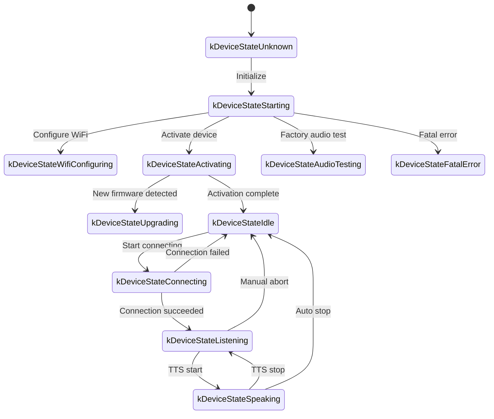
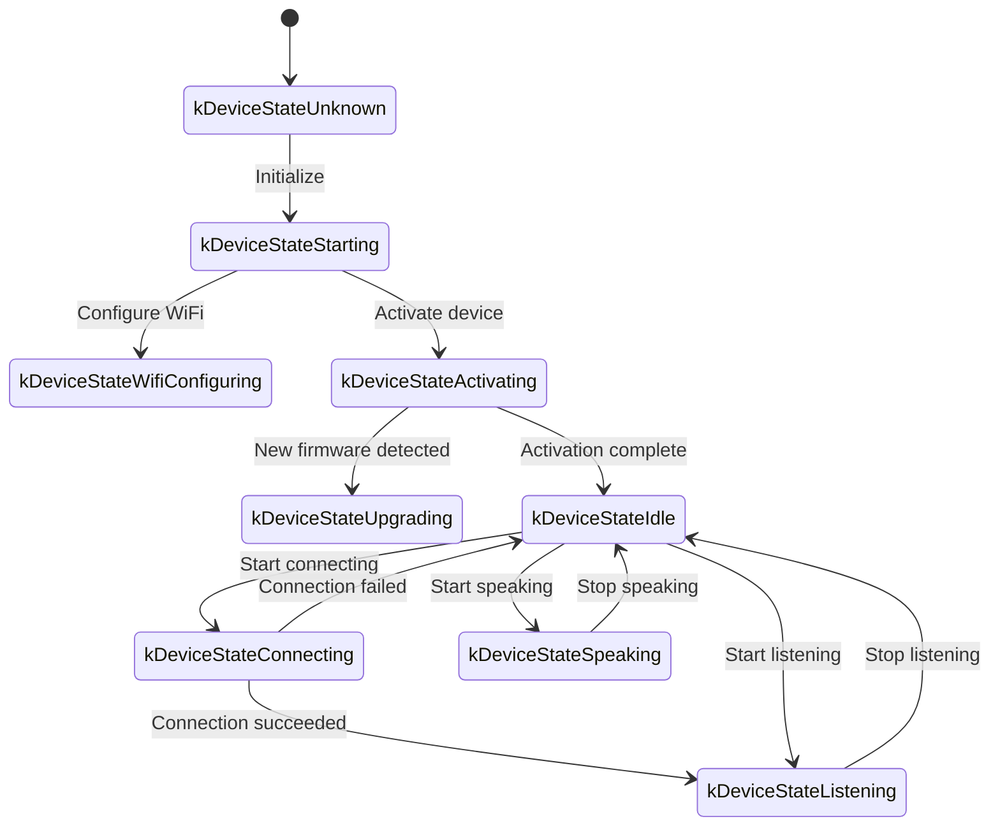

# Giao thức Truyền thông WebSocket

Tài liệu này mô tả giao thức truyền thông WebSocket giữa thiết bị và máy chủ, dựa trên mã hiện tại. Khi triển khai máy chủ, vui lòng kiểm tra chéo với việc triển khai thực tế.

---

## 1. Luồng Tổng thể

1. **Khởi tạo Thiết bị**
   - Thiết bị khởi động và khởi tạo `Application`:
     - Khởi tạo bộ mã hóa âm thanh, màn hình, đèn LED, v.v.
     - Kết nối với mạng.
     - Tạo một thể hiện giao thức WebSocket (`WebsocketProtocol`) thực hiện giao diện `Protocol`.
   - Vào vòng lặp chính và chờ các sự kiện (đầu vào âm thanh, đầu ra âm thanh, tác vụ theo lịch trình, v.v.).

2. **Mở kết nối WebSocket**
   - Khi thiết bị cần bắt đầu một phiên thoại giọng nói (thức dậy, nhấn nút, v.v.), nó gọi `OpenAudioChannel()`:
     - Đọc URL WebSocket từ cài đặt.
     - Đặt các tiêu đề yêu cầu (`Authorization`, `Protocol-Version`, `Device-Id`, `Client-Id`).
     - Gọi `Connect()` để thiết lập kết nối WebSocket.

3. **Thiết bị gửi tin nhắn "hello"**
   - Sau khi kết nối, thiết bị gửi một tin nhắn JSON. Ví dụ:
   ```json
   {
     "type": "hello",
     "version": 1,
     "features": {
       "mcp": true,
       "aec": true
     },
     "transport": "websocket",
     "audio_params": {
       "format": "opus",
       "sample_rate": 16000,
       "channels": 1,
       "frame_duration": 60
     }
   }
   ```
   - `features` là tùy chọn và được tạo từ cấu hình thời gian biên dịch. Ví dụ, `"mcp": true` có nghĩa là thiết bị hỗ trợ MCP, và `"aec": true` được phát ra khi `CONFIG_USE_SERVER_AEC` được bật.
   - `frame_duration` khớp với `OPUS_FRAME_DURATION_MS` (thường là 60 ms).

4. **Máy chủ trả lời bằng "hello"**
   - Thiết bị chờ một tin nhắn JSON có `"type"` là `"hello"` và `"transport"` là `"websocket"`.
   - Máy chủ có thể bao gồm một `session_id`; thiết bị sẽ lưu trữ nó.
   - Ví dụ:
   ```json
   {
     "type": "hello",
     "transport": "websocket",
     "session_id": "xxx",
     "audio_params": {
       "format": "opus",
       "sample_rate": 24000,
       "channels": 1,
       "frame_duration": 60
     }
   }
   ```
   - Nếu `transport` khớp, thiết bị đánh dấu kênh âm thanh đã mở.
   - Nếu không có hello hợp lệ nào đến trong thời gian chờ (mặc định 10 giây), kết nối được coi là thất bại và callback lỗi mạng được kích hoạt.

5. **Các trao đổi tiếp theo**
   - Hai loại dữ liệu được gửi theo cả hai hướng:
     1. **Dữ liệu âm thanh nhị phân** (mã hóa Opus)
     2. **Tin nhắn JSON văn bản** (trạng thái trò chuyện, sự kiện TTS/STT, tin nhắn MCP, v.v.)

   - Trong mã, callback nhận sẽ phân tách lưu lượng truy cập như sau:
     - `OnData(...)`:
       - Nếu `binary` là `true`, tải trọng được xử lý như một khung Opus và được giải mã.
       - Nếu `binary` là `false`, tải trọng được phân tích cú pháp dưới dạng JSON và được gửi đi theo `type`.

   - Khi máy chủ hoặc mạng bị ngắt, `OnDisconnected()` được kích hoạt:
     - Thiết bị gọi `on_audio_channel_closed_()` và cuối cùng quay lại trạng thái nhàn rỗi.

6. **Đóng kết nối WebSocket**
   - Khi thiết bị muốn kết thúc phiên, nó gọi `CloseAudioChannel()` để chấm dứt socket và quay lại trạng thái nhàn rỗi.
   - Chuỗi callback tương tự sẽ chạy nếu máy chủ đóng socket trước.

---

## 2. Các Tiêu đề Yêu cầu Chung

Khi thiết lập kết nối WebSocket, thiết bị đặt các tiêu đề sau:

- `Authorization`: mã truy cập, thường được định dạng là `"Bearer <token>"`.
- `Protocol-Version`: số phiên bản giao thức, khớp với trường `version` trong tin nhắn hello.
- `Device-Id`: địa chỉ MAC vật lý của thiết bị.
- `Client-Id`: UUID được tạo bằng phần mềm (được đặt lại khi NVS bị xóa hoặc firmware đầy đủ được nạp lại).

Các tiêu đề này được gửi cùng với bắt tay WebSocket; máy chủ có thể sử dụng chúng để xác thực hoặc ghi sổ.

---

## 3. Các Phiên bản Giao thức Nhị phân

Thiết bị hỗ trợ một số phiên bản giao thức nhị phân, được chọn bằng trường `version` trong cài đặt:

### 3.1 Phiên bản 1 (mặc định)
Các khung Opus thô không có siêu dữ liệu bổ sung. Lớp WebSocket đã phân biệt văn bản và nhị phân.

### 3.2 Phiên bản 2
Sử dụng cấu trúc `BinaryProtocol2`:
```c
struct BinaryProtocol2 {
    uint16_t version;        // phiên bản giao thức
    uint16_t type;           // loại tin nhắn (0: OPUS, 1: JSON)
    uint32_t reserved;       // dành riêng
    uint32_t timestamp;      // dấu thời gian bằng mili giây (hữu ích cho AEC phía máy chủ)
    uint32_t payload_size;   // kích thước tải trọng bằng byte
    uint8_t payload[];       // tải trọng
} __attribute__((packed));
```

### 3.3 Phiên bản 3
Sử dụng cấu trúc `BinaryProtocol3`:
```c
struct BinaryProtocol3 {
    uint8_t type;            // loại tin nhắn
    uint8_t reserved;        // dành riêng
    uint16_t payload_size;   // kích thước tải trọng
    uint8_t payload[];       // tải trọng
} __attribute__((packed));
```

---

## 4. Cấu trúc Tin nhắn JSON

Các khung văn bản WebSocket mang JSON. Các giá trị `"type"` phổ biến nhất và ngữ nghĩa của chúng được liệt kê dưới đây. Các trường không được liệt kê có thể là cụ thể của việc triển khai hoặc tùy chọn.

### 4.1 Thiết bị -> Máy chủ

1. **Hello**
   - Được gửi một lần khi kết nối được thiết lập; thông báo các tham số của thiết bị.
   - Ví dụ:
     ```json
     {
       "type": "hello",
       "version": 1,
       "features": {
         "mcp": true,
         "aec": true
       },
       "transport": "websocket",
       "audio_params": {
         "format": "opus",
         "sample_rate": 16000,
         "channels": 1,
         "frame_duration": 60
       }
     }
     ```

2. **Listen**
   - Cho máy chủ biết rằng thiết bị đang bắt đầu hoặc dừng thu âm thanh.
   - Các trường phổ biến:
     - `"session_id"`: định danh phiên.
     - `"type": "listen"`
     - `"state"`: `"start"`, `"stop"`, hoặc `"detect"` (phát hiện từ khóa).
     - `"mode"`: `"auto"`, `"manual"`, hoặc `"realtime"`.
   - Ví dụ (bắt đầu lắng nghe):
     ```json
     {
       "session_id": "xxx",
       "type": "listen",
       "state": "start",
       "mode": "manual"
     }
     ```

3. **Abort**
   - Hủy bỏ việc phát TTS hiện tại hoặc kênh giọng nói.
   - Ví dụ:
     ```json
     {
       "session_id": "xxx",
       "type": "abort",
       "reason": "wake_word_detected"
     }
     ```
   - `reason` có thể là `"wake_word_detected"` hoặc các giá trị được xác định bởi việc triển khai khác.

4. **Phát hiện Từ khóa**
   - Được gửi bởi thiết bị khi bộ phát hiện từ khóa cục bộ kích hoạt.
   - Âm thanh Opus chứa từ khóa có thể được truyền phát trước tin nhắn này để cho phép máy chủ chạy xác minh giọng nói.
   - Ví dụ:
     ```json
     {
       "session_id": "xxx",
       "type": "listen",
       "state": "detect",
       "text": "Hi XiaoZhi"
     }
     ```

5. **MCP**
   - Kênh được khuyến nghị cho điều khiển IoT. Khám phá khả năng của thiết bị và gọi công cụ đều được truyền qua các tin nhắn `type: "mcp"` có `payload` là JSON-RPC 2.0 (xem [tài liệu giao thức MCP](./mcp-protocol.md)).
   - Ví dụ phản hồi từ thiết bị đến máy chủ:
     ```json
     {
       "session_id": "xxx",
       "type": "mcp",
       "payload": {
         "jsonrpc": "2.0",
         "id": 1,
         "result": {
           "content": [
             { "type": "text", "text": "true" }
           ],
           "isError": false
         }
       }
     }
     ```

---

### 4.2 Máy chủ -> Thiết bị

1. **Hello**
   - Xác nhận bắt tay.
   - Phải bao gồm `"type": "hello"` và `"transport": "websocket"`.
   - Có thể bao gồm `audio_params`, nghĩa là các tham số âm thanh mà máy chủ mong đợi / tập hợp chuẩn được thống nhất với thiết bị.
   - Có thể bao gồm một `session_id` mà thiết bị ghi lại.
   - Sau khi nhận, thiết bị đặt sự kiện "kênh âm thanh mở".

2. **STT**
   - `{"session_id": "xxx", "type": "stt", "text": "..."}`
   - Kết quả chuyển giọng nói thành văn bản cho lời nói của người dùng. Thường được hiển thị trên màn hình trước khi chuyển sang phản hồi.

3. **LLM**
   - `{"session_id": "xxx", "type": "llm", "emotion": "happy", "text": "😀"}`
   - Cho thiết bị cập nhật cảm xúc / biểu cảm khuôn mặt trên UI.

4. **TTS**
   - `{"session_id": "xxx", "type": "tts", "state": "start"}`: máy chủ sắp truyền phát âm thanh TTS. Thiết bị chuyển sang trạng thái nói.
   - `{"session_id": "xxx", "type": "tts", "state": "stop"}`: phân đoạn TTS đã hoàn thành.
   - `{"session_id": "xxx", "type": "tts", "state": "sentence_start", "text": "..."}`: hiển thị câu hiện tại trên UI (ví dụ: hiển thị phụ đề).

5. **MCP**
   - Máy chủ gửi các lệnh liên quan đến IoT hoặc nhận kết quả gọi công cụ. Cấu trúc `payload` tuân theo JSON-RPC 2.0.
   - Ví dụ `tools/call` từ máy chủ đến thiết bị:
     ```json
     {
       "session_id": "xxx",
       "type": "mcp",
       "payload": {
         "jsonrpc": "2.0",
         "method": "tools/call",
         "params": {
           "name": "self.light.set_rgb",
           "arguments": { "r": 255, "g": 0, "b": 0 }
         },
         "id": 1
       }
     }
     ```

6. **System**
   - Điều khiển cấp hệ thống, thường được sử dụng cho nâng cấp / quản lý từ xa.
   - Ví dụ:
     ```json
     {
       "session_id": "xxx",
       "type": "system",
       "command": "reboot"
     }
     ```
   - Các lệnh được hỗ trợ:
     - `"reboot"`: khởi động lại thiết bị.

7. **Alert**
   - Hướng dẫn thiết bị hiển thị cảnh báo và phát âm thanh rung. Được xử lý trong `Application::OnIncomingJson`.
   - Ví dụ:
     ```json
     {
       "session_id": "xxx",
       "type": "alert",
       "status": "Warning",
       "message": "Battery low",
       "emotion": "sad"
     }
     ```
   - Các trường:
     - `status`: tiêu đề ngắn hiển thị trên màn hình.
     - `message`: tin nhắn chi tiết.
     - `emotion`: cảm xúc được hiển thị trong khi cảnh báo (ví dụ: `"sad"`, `"neutral"`).

8. **Custom** (tùy chọn)
   - Có sẵn khi `CONFIG_RECEIVE_CUSTOM_MESSAGE` được bật.
   - Ví dụ:
     ```json
     {
       "session_id": "xxx",
       "type": "custom",
       "payload": {
         "message": "anything you want"
       }
     }
     ```

9. **Các khung âm thanh nhị phân**
   - Khi máy chủ đẩy âm thanh được mã hóa Opus dưới dạng khung nhị phân, thiết bị sẽ giải mã và phát chúng.
   - Các khung nhận được trong khi thiết bị ở trạng thái `listening` sẽ bị loại bỏ để tránh xung đột với luồng microphone.

---

## 5. Bộ Mã hóa Âm thanh

1. **Thiết bị tải lên âm thanh microphone**
   - Sau khi xử lý AEC / NR / AGC tùy chọn, âm thanh được mã hóa Opus và gửi dưới dạng khung nhị phân.
   - Tùy thuộc vào phiên bản giao thức, các khung có thể là Opus thô (v1) hoặc được bọc trong các cấu trúc siêu dữ liệu (v2/v3).

2. **Thiết bị phát âm thanh máy chủ**
   - Các khung nhị phân đến cũng được xử lý như Opus.
   - Thiết bị giải mã và gửi chúng đến đầu ra âm thanh.
   - Nếu tốc độ mẫu khác với đầu ra của thiết bị, nó sẽ được lấy mẫu lại sau khi giải mã.

---

## 6. Trạng thái Thiết bị

### 6.1 Các trạng thái chính

Máy trạng thái thiết bị được định nghĩa trong [`main/device_state.h`](../main/device_state.h) và bao gồm:

- `kDeviceStateUnknown`
- `kDeviceStateStarting`
- `kDeviceStateWifiConfiguring`
- `kDeviceStateIdle`
- `kDeviceStateConnecting`
- `kDeviceStateListening`
- `kDeviceStateSpeaking`
- `kDeviceStateUpgrading`
- `kDeviceStateActivating`
- `kDeviceStateAudioTesting` (kiểm tra âm thanh nhà máy / khởi động)
- `kDeviceStateFatalError` (lỗi không thể phục hồi yêu cầu hành động của người dùng)

### 6.2 Các chuyển đổi điển hình

1. **Idle -> Connecting**
   - Được kích hoạt bởi từ khóa hoặc nhấn nút. Thiết bị gọi `OpenAudioChannel()`, thiết lập WebSocket và gửi `"type":"hello"`.

2. **Connecting -> Listening**
   - Sau khi kết nối, `SendStartListening(...)` được gọi và bắt đầu truyền phát microphone.

3. **Listening -> Speaking**
   - Máy chủ gửi `{"type":"tts","state":"start"}`; thiết bị ngừng gửi âm thanh mic và phát TTS đến.

4. **Speaking -> Idle**
   - Máy chủ gửi `{"type":"tts","state":"stop"}`. Khi tự động tiếp tục được bật, thiết bị chuyển trở lại Listening; nếu không, nó quay lại Idle.

5. **Listening / Speaking -> Idle** (hủy bỏ)
   - `SendAbortSpeaking(...)` hoặc `CloseAudioChannel()` ngắt phiên và đóng WebSocket.

### 6.3 Sơ đồ trạng thái Chế độ Tự động



### 6.4 Sơ đồ trạng thái Chế độ Thủ công



---

## 7. Xử lý Lỗi

1. **Lỗi kết nối**
   - Nếu `Connect(url)` thất bại hoặc máy chủ hello không được nhận trước thời gian chờ, `on_network_error_()` được gọi và thiết bị hiển thị cảnh báo "không thể kết nối".

2. **Ngắt kết nối máy chủ**
   - Nếu WebSocket bị ngắt đột ngột, `OnDisconnected()` được gọi:
     - `on_audio_channel_closed_()` chạy.
     - Thiết bị quay lại Idle (hoặc thử lại, tùy thuộc vào chính sách).

---

## 8. Các Lưu ý Khác

1. **Xác thực**
   - Thiết bị cung cấp `Authorization: Bearer <token>`; máy chủ phải xác thực nó.
   - Nếu token bị thiếu hoặc không hợp lệ, máy chủ có thể từ chối bắt tay hoặc chấm dứt phiên sau này.

2. **Phạm vi phiên**
   - Nhiều tin nhắn mang `session_id`, hữu ích khi máy chủ phục vụ nhiều tương tác đồng thời.

3. **Tải trọng âm thanh**
   - Định dạng âm thanh mặc định là Opus ở 16 kHz, đơn kênh. Thời lượng khung được kiểm soát bởi `OPUS_FRAME_DURATION_MS` (thường là 60 ms). Máy chủ có thể sử dụng 24 kHz ở đường xuống để phát nhạc tốt hơn.

4. **Lựa chọn phiên bản giao thức nhị phân**
   - Được cấu hình thông qua cài đặt `version`:
     - v1: Opus thô
     - v2: siêu dữ liệu + dấu thời gian (hữu ích cho AEC phía máy chủ)
     - v3: tiêu đề nhẹ
   - Giá trị được phản hồi lại trong tiêu đề `Protocol-Version` và tin nhắn hello.

5. **Điều khiển IoT qua MCP**
   - Tất cả khám phá khả năng và điều khiển IoT đều thông qua MCP (`type: "mcp"`). Giao thức `type: "iot"` cũ đã bị loại bỏ.
   - MCP hoạt động qua cả WebSocket và MQTT, mang lại tiêu chuẩn hóa và khả năng mở rộng tốt hơn.
   - Xem [tài liệu giao thức MCP](./mcp-protocol.md) và [sử dụng điều khiển IoT MCP](./mcp-usage.md) để biết chi tiết.

6. **JSON bị lỗi**
   - Khi một trường bắt buộc như `type` bị thiếu, thiết bị ghi nhật ký `ESP_LOGE(TAG, "Missing message type, data: %s", data);` và bỏ qua tin nhắn.

---

## 9. Ví dụ Luồng Tin nhắn

Một trao đổi hai chiều đơn giản hóa:

1. **Thiết bị -> Máy chủ** (bắt tay)
   ```json
   {
     "type": "hello",
     "version": 1,
     "features": {
       "mcp": true,
       "aec": true
     },
     "transport": "websocket",
     "audio_params": {
       "format": "opus",
       "sample_rate": 16000,
       "channels": 1,
       "frame_duration": 60
     }
   }
   ```

2. **Máy chủ -> Thiết bị** (xác nhận bắt tay)
   ```json
   {
     "type": "hello",
     "transport": "websocket",
     "session_id": "xxx",
     "audio_params": {
       "format": "opus",
       "sample_rate": 16000
     }
   }
   ```

3. **Thiết bị -> Máy chủ** (bắt đầu lắng nghe)
   ```json
   {
     "session_id": "xxx",
     "type": "listen",
     "state": "start",
     "mode": "auto"
   }
   ```
   Thiết bị bắt đầu truyền phát các khung Opus nhị phân.

4. **Máy chủ -> Thiết bị** (kết quả ASR)
   ```json
   {
     "session_id": "xxx",
     "type": "stt",
     "text": "what the user said"
   }
   ```

5. **Máy chủ -> Thiết bị** (bắt đầu TTS)
   ```json
   {
     "session_id": "xxx",
     "type": "tts",
     "state": "start"
   }
   ```
   Máy chủ tiếp tục bằng các khung Opus nhị phân để thiết bị phát.

6. **Máy chủ -> Thiết bị** (dừng TTS)
   ```json
   {
     "session_id": "xxx",
     "type": "tts",
     "state": "stop"
   }
   ```
   Thiết bị dừng phát và, nếu không có hướng dẫn nào khác đến, sẽ quay lại trạng thái nhàn rỗi.

---

## 10. Tóm tắt

Giao thức này truyền văn bản JSON và các khung Opus nhị phân qua kết nối WebSocket để triển khai truyền phát âm thanh, phát TTS, nhận dạng giọng nói, quản lý trạng thái thiết bị, gửi MCP, và nhiều hơn nữa. Các đặc điểm chính:

- **Bắt tay**: gửi `"type":"hello"` và chờ phản hồi từ máy chủ.
- **Kênh âm thanh**: truyền phát Opus hai chiều, với ba biến thể đóng khung nhị phân.
- **Tin nhắn JSON**: được gửi đi theo `"type"` (TTS, STT, MCP, WakeWord, System, Alert, Custom, ...).
- **Khả năng mở rộng**: các trường bổ sung trong JSON, các tiêu đề bổ sung để xác thực.

Máy chủ và thiết bị phải thống nhất về ý nghĩa, thời gian và xử lý lỗi của từng loại tin nhắn để phiên chạy trơn tru. Văn bản trên cung cấp cơ sở để tích hợp, gỡ lỗi và mở rộng.
