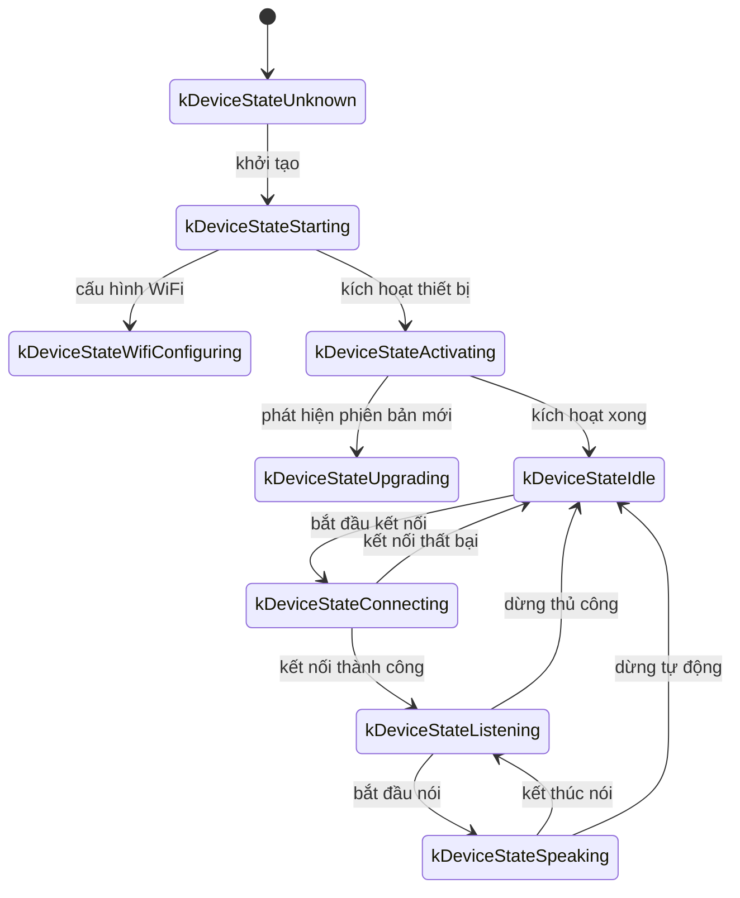
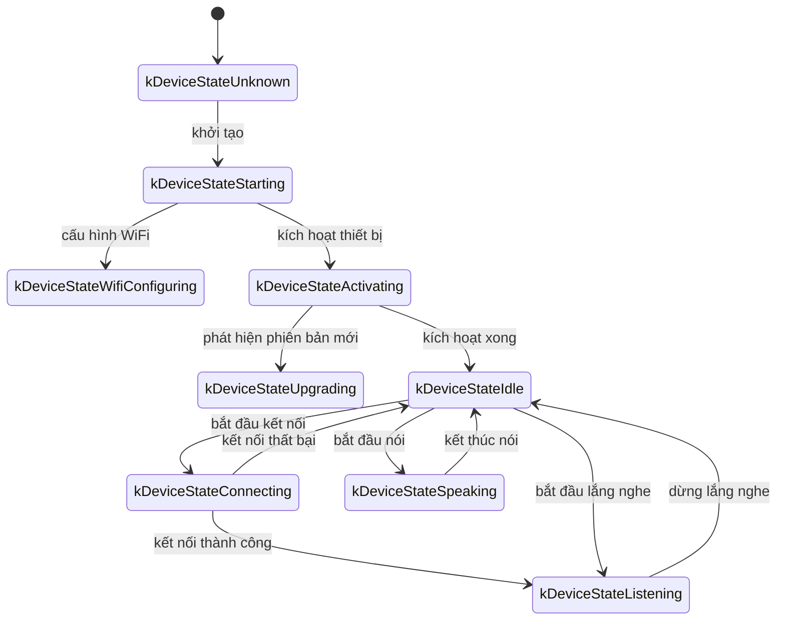

# Tài liệu giao thức WebSocket chi tiết

Đây là tài liệu giao thức WebSocket được tổng hợp từ cách triển khai trong code, mô tả tổng quan cách thiết bị và máy chủ tương tác qua WebSocket.

Tài liệu này chỉ dựa trên phần code được cung cấp để suy luận. Khi triển khai thực tế, có thể cần đối chiếu thêm với phần server để xác nhận hoặc bổ sung.

---

## 1. Tổng quan luồng hoạt động

1. **Khởi tạo ở phía thiết bị**
   - Thiết bị bật nguồn và khởi tạo `Application`:
     - Khởi tạo codec âm thanh, màn hình, LED, v.v.
     - Kết nối mạng
     - Tạo và khởi tạo một instance WebSocket triển khai giao diện `Protocol` (`WebsocketProtocol`)
   - Vào vòng lặp chính để chờ sự kiện (âm thanh vào, âm thanh ra, tác vụ lịch, v.v.).

2. **Thiết lập kết nối WebSocket**
   - Khi thiết bị cần bắt đầu một phiên thoại (ví dụ người dùng đánh thức, nhấn nút thủ công, v.v.), gọi `OpenAudioChannel()`:
     - Lấy URL WebSocket từ cấu hình
     - Thiết lập các header request (`Authorization`, `Protocol-Version`, `Device-Id`, `Client-Id`)
     - Gọi `Connect()` để thiết lập kết nối WebSocket với server

3. **Thiết bị gửi thông điệp "hello"**
   - Sau khi kết nối thành công, thiết bị gửi một thông điệp JSON như sau:
   ```json
   {
     "type": "hello",
     "version": 1,
     "features": {
       "mcp": true
     },
     "transport": "websocket",
     "audio_params": {
       "format": "opus",
       "sample_rate": 16000,
       "channels": 1,
       "frame_duration": 60
     }
   }
   ```
   - Trường `features` là tùy chọn, nội dung được tạo tự động theo cấu hình build. Ví dụ `"mcp": true` nghĩa là hỗ trợ giao thức MCP.
   - Giá trị `frame_duration` tương ứng với `OPUS_FRAME_DURATION_MS` (ví dụ 60ms).

4. **Server trả lời "hello"**
   - Thiết bị chờ server trả về một JSON có `"type": "hello"` và kiểm tra `"transport": "websocket"` có khớp hay không.
   - Server có thể gửi thêm trường `session_id`, thiết bị sẽ tự ghi nhận khi nhận được.
   - Ví dụ:
   ```json
   {
     "type": "hello",
     "transport": "websocket",
     "session_id": "xxx",
     "audio_params": {
       "format": "opus",
       "sample_rate": 24000,
       "channels": 1,
       "frame_duration": 60
     }
   }
   ```
   - Nếu khớp, coi như server đã sẵn sàng và đánh dấu mở kênh âm thanh thành công.
   - Nếu quá thời gian chờ mặc định 10 giây mà không nhận đúng phản hồi thì coi như thất bại và gọi callback lỗi mạng.

5. **Trao đổi thông điệp tiếp theo**
   - Giữa thiết bị và server có thể truyền hai loại dữ liệu chính:
     1. **Dữ liệu âm thanh nhị phân** (mã hóa Opus)
     2. **Thông điệp JSON dạng text** (dùng cho trạng thái chat, sự kiện TTS/STT, thông điệp MCP, v.v.)

   - Trong code, callback nhận dữ liệu chủ yếu là:
     - `OnData(...)`:
       - Khi `binary` là `true`, xem như frame âm thanh; thiết bị giải mã như dữ liệu Opus.
       - Khi `binary` là `false`, xem như JSON text; thiết bị phân tích bằng cJSON và xử lý logic tương ứng (chat, TTS, MCP, v.v.).

   - Khi server hoặc mạng bị ngắt, callback `OnDisconnected()` được gọi:
     - Thiết bị sẽ gọi `on_audio_channel_closed_()` và quay về trạng thái rảnh.

6. **Đóng kết nối WebSocket**
   - Khi cần kết thúc phiên thoại, thiết bị gọi `CloseAudioChannel()` để chủ động ngắt kết nối và quay lại trạng thái rảnh.
   - Nếu server chủ động ngắt thì cũng dẫn đến cùng luồng callback như trên.

---

## 2. Các header request chung

Khi thiết lập kết nối WebSocket, code ví dụ thiết lập các header sau:

- `Authorization`: chứa token truy cập, dạng `"Bearer <token>"`
- `Protocol-Version`: số phiên bản giao thức, phải đồng bộ với trường `version` trong hello message
- `Device-Id`: địa chỉ MAC của card mạng vật lý trên thiết bị
- `Client-Id`: UUID do phần mềm tạo ra (sẽ đổi lại khi xóa NVS hoặc nạp lại full firmware)

Các header này được gửi cùng quá trình bắt tay WebSocket, server có thể kiểm tra và xác thực tùy nhu cầu.

---

## 3. Phiên bản giao thức nhị phân

Thiết bị hỗ trợ nhiều phiên bản giao thức nhị phân, được chỉ định qua trường `version` trong cấu hình:

### 3.1 Phiên bản 1 (mặc định)
Gửi trực tiếp dữ liệu âm thanh Opus, không có metadata bổ sung. Giao thức WebSocket sẽ phân biệt text và binary.

### 3.2 Phiên bản 2
Sử dụng cấu trúc `BinaryProtocol2`:
```c
struct BinaryProtocol2 {
    uint16_t version;        // Phiên bản giao thức
    uint16_t type;           // Loại thông điệp (0: OPUS, 1: JSON)
    uint32_t reserved;       // Trường dự phòng
    uint32_t timestamp;      // Dấu thời gian (ms, dùng cho AEC phía server)
    uint32_t payload_size;   // Kích thước payload (byte)
    uint8_t payload[];       // Dữ liệu payload
} __attribute__((packed));
```

### 3.3 Phiên bản 3
Sử dụng cấu trúc `BinaryProtocol3`:
```c
struct BinaryProtocol3 {
    uint8_t type;            // Loại thông điệp
    uint8_t reserved;        // Trường dự phòng
    uint16_t payload_size;   // Kích thước payload
    uint8_t payload[];       // Dữ liệu payload
} __attribute__((packed));
```

---

## 4. Cấu trúc thông điệp JSON

Frame text của WebSocket được truyền dưới dạng JSON, dưới đây là các giá trị `"type"` phổ biến và logic xử lý tương ứng. Nếu thông điệp có thêm trường không nêu ở đây, đó có thể là trường tùy chọn hoặc chi tiết của từng triển khai.

### 4.1 Thiết bị → server

1. **Hello**
   - Được gửi sau khi kết nối thành công để báo cho server biết các tham số cơ bản.
   - Ví dụ:
     ```json
     {
       "type": "hello",
       "version": 1,
       "features": {
         "mcp": true
       },
       "transport": "websocket",
       "audio_params": {
         "format": "opus",
         "sample_rate": 16000,
         "channels": 1,
         "frame_duration": 60
       }
     }
     ```

2. **Listen**
   - Cho biết thiết bị bắt đầu hoặc dừng ghi âm để lắng nghe.
   - Các trường thường gặp:
     - `"session_id"`: mã phiên
     - `"type": "listen"`
     - `"state"`: `"start"`, `"stop"`, `"detect"` (đã kích hoạt phát hiện từ đánh thức)
     - `"mode"`: `"auto"`, `"manual"` hoặc `"realtime"` để biểu thị chế độ nhận dạng
   - Ví dụ bắt đầu lắng nghe:
     ```json
     {
       "session_id": "xxx",
       "type": "listen",
       "state": "start",
       "mode": "manual"
     }
     ```

3. **Abort**
   - Dừng việc đang nói (TTS) hoặc dừng kênh thoại.
   - Ví dụ:
     ```json
     {
       "session_id": "xxx",
       "type": "abort",
       "reason": "wake_word_detected"
     }
     ```
   - Giá trị `reason` có thể là `"wake_word_detected"` hoặc giá trị khác.

4. **Phát hiện từ đánh thức**
   - Dùng để báo cho server biết thiết bị đã phát hiện từ đánh thức.
   - Trước khi gửi thông điệp này, có thể gửi sẵn âm thanh Opus của từ đánh thức để server nhận dạng giọng nói.
   - Ví dụ:
     ```json
     {
       "session_id": "xxx",
       "type": "listen",
       "state": "detect",
       "text": "xin chào"
     }
     ```

5. **MCP**
   - Giao thức thế hệ mới được khuyến nghị cho điều khiển IoT. Việc phát hiện năng lực thiết bị, gọi công cụ, v.v. đều dùng thông điệp `type: "mcp"`, phần `payload` là JSON-RPC 2.0 chuẩn (xem [tài liệu MCP](./mcp-protocol_zh.md)).
   
   - **Ví dụ thiết bị gửi result về server:**
     ```json
     {
       "session_id": "xxx",
       "type": "mcp",
       "payload": {
         "jsonrpc": "2.0",
         "id": 1,
         "result": {
           "content": [
             { "type": "text", "text": "true" }
           ],
           "isError": false
         }
       }
     }
     ```

---

### 4.2 Server → thiết bị

1. **Hello**
   - Thông điệp xác nhận bắt tay từ server.
   - Bắt buộc có `"type": "hello"` và `"transport": "websocket"`.
   - Có thể có `audio_params` để biểu thị tham số âm thanh server mong muốn, hoặc cấu hình khớp với thiết bị.
   - Server có thể gửi `session_id`, thiết bị sẽ tự ghi nhận khi nhận.
   - Sau khi nhận thành công, thiết bị sẽ đặt cờ sự kiện để báo kênh WebSocket đã sẵn sàng.

2. **STT**
   - `{"session_id": "xxx", "type": "stt", "text": "..."}`
   - Báo rằng server đã nhận dạng được giọng nói người dùng.
   - Thiết bị có thể hiển thị văn bản này lên màn hình rồi chuyển sang các bước tiếp theo.

3. **LLM**
   - `{"session_id": "xxx", "type": "llm", "emotion": "happy", "text": "😀"}`
   - Server yêu cầu thiết bị điều chỉnh hoạt ảnh biểu cảm / UI.

4. **TTS**
   - `{"session_id": "xxx", "type": "tts", "state": "start"}`: server chuẩn bị gửi âm thanh TTS, thiết bị vào trạng thái phát "speaking".
   - `{"session_id": "xxx", "type": "tts", "state": "stop"}`: kết thúc TTS lần này.
   - `{"session_id": "xxx", "type": "tts", "state": "sentence_start", "text": "..."}`
     - để thiết bị hiển thị đoạn văn bản sẽ được phát hoặc đọc lên.

5. **MCP**
   - Server gửi các lệnh điều khiển IoT hoặc kết quả gọi tool qua thông điệp `type: "mcp"`, cấu trúc `payload` giống như trên.
   
   - **Ví dụ server gửi `tools/call` xuống thiết bị:**
     ```json
     {
       "session_id": "xxx",
       "type": "mcp",
       "payload": {
         "jsonrpc": "2.0",
         "method": "tools/call",
         "params": {
           "name": "self.light.set_rgb",
           "arguments": { "r": 255, "g": 0, "b": 0 }
         },
         "id": 1
       }
     }
     ```

6. **System**
   - Lệnh điều khiển hệ thống, thường dùng cho cập nhật từ xa.
   - Ví dụ:
     ```json
     {
       "session_id": "xxx",
       "type": "system",
       "command": "reboot"
     }
     ```
   - Lệnh được hỗ trợ:
     - `"reboot"`: khởi động lại thiết bị

7. **Custom** (tùy chọn)
   - Thông điệp tùy biến, chỉ được hỗ trợ khi bật `CONFIG_RECEIVE_CUSTOM_MESSAGE`.
   - Ví dụ:
     ```json
     {
       "session_id": "xxx",
       "type": "custom",
       "payload": {
         "message": "nội dung tùy chỉnh"
       }
     }
     ```

8. **Dữ liệu âm thanh: frame nhị phân**
   - Khi server gửi frame âm thanh nhị phân (mã hóa Opus), thiết bị sẽ giải mã và phát.
   - Nếu thiết bị đang ở trạng thái "listening" (ghi âm), các frame âm thanh nhận được sẽ bị bỏ qua hoặc xóa để tránh xung đột.

---

## 5. Mã hóa/giải mã âm thanh

1. **Thiết bị gửi dữ liệu ghi âm**
   - Âm thanh đầu vào sau khi có thể được khử vọng, khử nhiễu hoặc tăng âm lượng sẽ được mã hóa Opus và đóng gói thành frame nhị phân gửi lên server.
   - Tùy phiên bản giao thức, có thể gửi trực tiếp Opus (version 1) hoặc dùng giao thức nhị phân có metadata (version 2/3).

2. **Thiết bị phát âm thanh nhận được**
   - Khi nhận frame nhị phân từ server, cũng coi như dữ liệu Opus.
   - Thiết bị sẽ giải mã rồi chuyển cho giao diện phát âm thanh.
   - Nếu tần số lấy mẫu của server khác với thiết bị, sẽ thực hiện resample sau khi giải mã.

---

## 6. Chuyển trạng thái thường gặp

Dưới đây là các trạng thái chính ở phía thiết bị và cách chúng tương ứng với message WebSocket:

1. **Idle** → **Connecting**
   - Sau khi người dùng kích hoạt hoặc đánh thức, thiết bị gọi `OpenAudioChannel()` → tạo kết nối WebSocket → gửi `"type":"hello"`.

2. **Connecting** → **Listening**
   - Sau khi kết nối thành công, nếu tiếp tục gọi `SendStartListening(...)` thì thiết bị vào trạng thái ghi âm. Lúc này thiết bị sẽ liên tục mã hóa dữ liệu micro và gửi lên server.

3. **Listening** → **Speaking**
   - Nhận message TTS Start từ server (`{"type":"tts","state":"start"}`) → dừng ghi âm và phát âm thanh nhận được.

4. **Speaking** → **Idle**
   - Server gửi TTS Stop (`{"type":"tts","state":"stop"}`) → việc phát âm thanh kết thúc. Nếu không tiếp tục nghe tự động thì quay lại Idle; nếu có cấu hình vòng lặp tự động thì sẽ vào lại Listening.

5. **Listening** / **Speaking** → **Idle** (gặp lỗi hoặc bị ngắt chủ động)
   - Gọi `SendAbortSpeaking(...)` hoặc `CloseAudioChannel()` → ngắt phiên → đóng WebSocket → trạng thái về Idle.

### Sơ đồ chuyển trạng thái ở chế độ tự động



### Sơ đồ chuyển trạng thái ở chế độ thủ công



---

## 7. Xử lý lỗi

1. **Kết nối thất bại**
   - Nếu `Connect(url)` trả về thất bại hoặc quá thời gian chờ khi đợi message `"hello"` từ server, sẽ gọi `on_network_error_()`. Thiết bị sẽ hiển thị lỗi kiểu "không thể kết nối tới dịch vụ" hoặc tương tự.

2. **Server ngắt kết nối**
   - Nếu WebSocket bị ngắt bất thường, callback `OnDisconnected()` sẽ chạy:
     - thiết bị gọi `on_audio_channel_closed_()`
     - chuyển về Idle hoặc cơ chế thử lại khác.

---

## 8. Lưu ý khác

1. **Xác thực**
   - Thiết bị xác thực bằng header `Authorization: Bearer <token>`, server cần kiểm tra token hợp lệ.
   - Nếu token hết hạn hoặc không hợp lệ, server có thể từ chối bắt tay hoặc ngắt về sau.

2. **Điều khiển phiên**
   - Một số thông điệp có `session_id` để phân biệt các cuộc trò chuyện hoặc thao tác riêng. Server có thể tách xử lý theo từng phiên nếu cần.

3. **Payload âm thanh**
   - Code mặc định dùng định dạng Opus, `sample_rate = 16000`, mono. Độ dài frame do `OPUS_FRAME_DURATION_MS` điều khiển, thường là 60ms. Có thể điều chỉnh theo băng thông hoặc hiệu năng. Để phát nhạc tốt hơn, âm thanh từ server có thể dùng 24000 sample rate.

4. **Cấu hình phiên bản giao thức**
   - Thiết lập trường `version` để chọn phiên bản giao thức nhị phân (1, 2 hoặc 3)
   - Phiên bản 1: gửi trực tiếp dữ liệu Opus
   - Phiên bản 2: dùng giao thức nhị phân có timestamp, phù hợp cho AEC phía server
   - Phiên bản 3: dùng giao thức nhị phân rút gọn

5. **Khuyến nghị dùng MCP cho điều khiển IoT**
   - Khám phá năng lực IoT, đồng bộ trạng thái, lệnh điều khiển giữa thiết bị và server nên thực hiện qua MCP (`type: "mcp"`). Cách cũ `type: "iot"` đã bị loại bỏ.
   - MCP có thể truyền trên nhiều giao thức nền như WebSocket, MQTT, v.v., nên mở rộng và chuẩn hóa tốt hơn.
   - Chi tiết xem thêm [tài liệu MCP](./mcp-protocol_zh.md) và [hướng dẫn điều khiển IoT bằng MCP](./mcp-usage_zh.md).

6. **JSON lỗi hoặc bất thường**
   - Khi JSON thiếu trường bắt buộc, ví dụ `{"type": ...}`, thiết bị sẽ ghi log lỗi (`ESP_LOGE(TAG, "Missing message type, data: %s", data);`) và không thực thi bất kỳ nghiệp vụ nào.

---

## 9. Ví dụ message

Dưới đây là một ví dụ giao tiếp hai chiều điển hình (luồng đã được đơn giản hóa):

1. **Thiết bị → server** (bắt tay)
   ```json
   {
     "type": "hello",
     "version": 1,
     "features": {
       "mcp": true
     },
     "transport": "websocket",
     "audio_params": {
       "format": "opus",
       "sample_rate": 16000,
       "channels": 1,
       "frame_duration": 60
     }
   }
   ```

2. **Server → thiết bị** (trả lời bắt tay)
   ```json
   {
     "type": "hello",
     "transport": "websocket",
     "session_id": "xxx",
     "audio_params": {
       "format": "opus",
       "sample_rate": 16000
     }
   }
   ```

3. **Thiết bị → server** (bắt đầu lắng nghe)
   ```json
   {
     "session_id": "xxx",
     "type": "listen",
     "state": "start",
     "mode": "auto"
   }
   ```
   Đồng thời thiết bị bắt đầu gửi các frame nhị phân (dữ liệu Opus).

4. **Server → thiết bị** (kết quả ASR)
   ```json
   {
     "session_id": "xxx",
     "type": "stt",
     "text": "câu người dùng nói"
   }
   ```

5. **Server → thiết bị** (bắt đầu TTS)
   ```json
   {
     "session_id": "xxx",
     "type": "tts",
     "state": "start"
   }
   ```
   Sau đó server gửi các frame âm thanh nhị phân để thiết bị phát.

6. **Server → thiết bị** (kết thúc TTS)
   ```json
   {
     "session_id": "xxx",
     "type": "tts",
     "state": "stop"
   }
   ```
   Thiết bị dừng phát âm thanh, nếu không có lệnh nào khác thì quay lại trạng thái rảnh.

---

## 10. Tóm tắt

Giao thức này truyền JSON text và frame âm thanh nhị phân ở tầng trên của WebSocket để hoàn thành các chức năng như upload luồng âm thanh, phát TTS, nhận dạng giọng nói, quản lý trạng thái và đẩy lệnh MCP. Các đặc điểm cốt lõi:

- **Giai đoạn bắt tay**: gửi `"type":"hello"` và chờ server trả lời
- **Kênh âm thanh**: truyền hai chiều giọng nói bằng frame nhị phân mã hóa Opus, hỗ trợ nhiều phiên bản giao thức
- **Thông điệp JSON**: dùng trường `"type"` làm lõi để phân biệt các nghiệp vụ như TTS, STT, MCP, WakeWord, System, Custom, v.v.
- **Khả năng mở rộng**: có thể thêm trường mới vào JSON hoặc bổ sung xác thực ở header tùy yêu cầu thực tế

Hai phía server và thiết bị nên thống nhất sớm về ý nghĩa các trường, thứ tự logic và cách xử lý lỗi để đảm bảo giao tiếp ổn định. Những thông tin trên có thể dùng làm tài liệu cơ sở cho tích hợp, phát triển hoặc mở rộng về sau.
